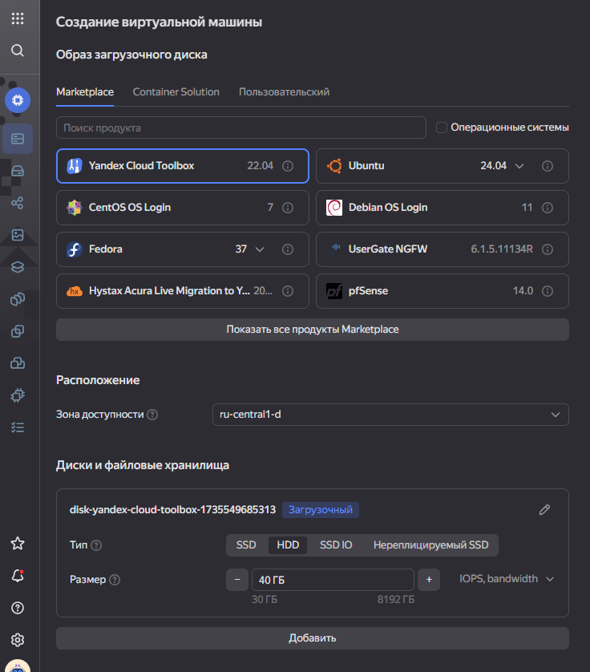
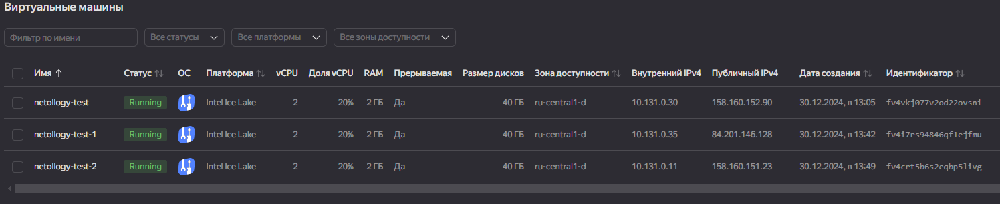
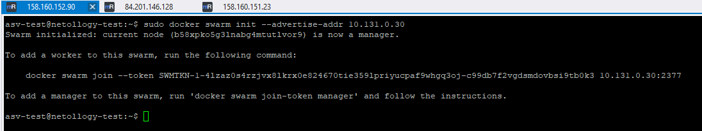
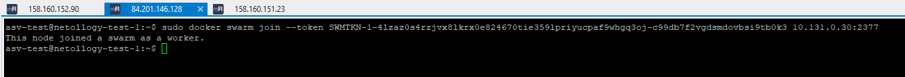
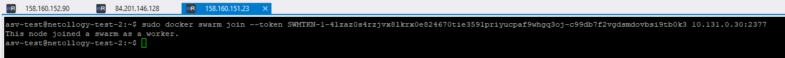
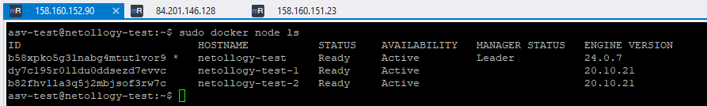

# Домашнее задание к занятию "`Оркестрация кластером Docker контейнеров на примере Docker Swarm`" - `Дедюрин Денис`

В Yandex.Cloud развернуто 3 ВМ на базе образа "Yandex Cloud Toolbox"



Docker ставить не обязательно, т.к. он уже имеется в данном образе.

В итоге имеем:
- netollogy-test - Master нода
- netollogy-test-1 - Worker 1
- netollogy-test-2 - Worker 2

На мастер-ноде выполним команду для инициализации Swarm-кластера:
```
sudo docker swarm init --advertise-addr 10.131.0.30
```


На каждой из рабочих нод выполнним команду, полученную при инициализации Swarm на мастер-ноде.
```
sudo docker swarm join --token SWMTKN-1-4lzaz0s4rzjvx8lkrx0e824670tie359lpriyucpaf9whgq3oj-c99db7f2vgdsmdovbsi9tb0k3 10.131.0.30:2377
```




После присоединения нод, на мастер-нод и выполним команду:
```
sudo docker node ls
```


Видим, что все ноды отображаются как Ready и Active, значит кластер настроен корректно.